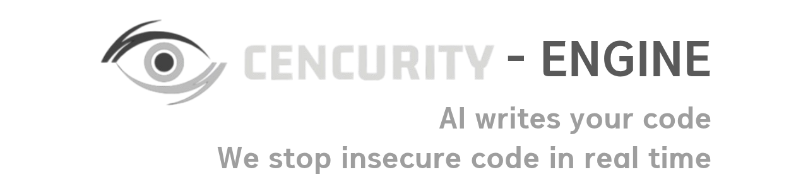

<p align="center">
	
</p>

# Cencurity Engine

CAST = Continuous-on-Authoring Security Testing.

Cencurity Engine is a local guardrail server for AI coding tools.

It sits between your IDE and the model provider.

It can:

- pass safe output through
- hide sensitive output with `redact`
- stop dangerous output with `block`

## Quickstart

This is the ultra-simple user flow.

### Ultra-simple version

1. Keep your provider API key in your IDE or coding client
2. Open a terminal in this repository
3. Start the engine:

```powershell
go run ./cmd/cast serve --listen :8080 --upstream https://your-llm-base-url --policy .\cast.rules.example.json
```

4. Change your IDE base URL to `http://localhost:8080`
5. Keep using your IDE like normal

Replace `https://your-llm-base-url` with your real provider base URL.

`cast.rules.example.json` is the normal starter policy file in this repo, not a mock-test-only file.

Other provider examples:

```powershell
go run ./cmd/cast serve --listen :8080 --upstream https://api.anthropic.com --policy .\cast.rules.example.json
go run ./cmd/cast serve --listen :8080 --upstream https://api.deepseek.com --policy .\cast.rules.example.json
go run ./cmd/cast serve --listen :8080 --upstream https://api.x.ai --policy .\cast.rules.example.json
```

What this command does:

- starts the local Cencurity Engine server on port `8080`
- forwards your IDE requests to the provider in `--upstream`
- applies the policy in `cast.rules.example.json` before traffic leaves your machine

### Main local URLs

- Engine base URL: `http://localhost:8080`
- Health check: [http://localhost:8080/healthz](http://localhost:8080/healthz)
- Metrics: [http://localhost:8080/metrics](http://localhost:8080/metrics)

### What this means in practice

- your IDE keeps the API key
- Cencurity Engine forwards that auth header upstream
- your IDE sends model traffic to `http://localhost:8080`
- Cencurity Engine sits in the middle before traffic reaches the provider

### Provider path examples

- OpenAI-compatible chat completions: `http://localhost:8080/v1/chat/completions`
- Anthropic Messages: `http://localhost:8080/v1/messages`
- Gemini streaming REST: `http://localhost:8080/v1beta/models/{model}:streamGenerateContent`

### Quick answers

- Do I need to put my API key into Cencurity Engine? No, usually not.
- What do most users do? Start the server, then point the IDE base URL to `http://localhost:8080`.
- What happens if I do not change the IDE base URL? Your traffic keeps going directly to the provider.

### Optional checks

```powershell
go run ./cmd/cast doctor
go run ./cmd/cast version
```

## Product overview

### CAST vs SAST

| Model | When it runs | Main job | Typical result |
| --- | --- | --- | --- |
| `CAST` | while the model is still writing code | stop unsafe output before it reaches the developer | `allow`, `redact`, `block` |
| `SAST` | after code already exists | scan code for vulnerabilities | findings after generation |
| `DAST` | against a running app | test runtime behavior | runtime issues after deployment or staging |
| `IAST` | inside an instrumented app | watch real execution paths | internal runtime findings |

The point is not that CAST replaces SAST.

The point is that CAST protects a different moment: **while code is being generated**.

### Tier map

| Tier | What it covers | Typical behavior |
| --- | --- | --- |
| `Universal Guard` | secrets, tokens, JSON, YAML, config-like payloads, dangerous command strings | detect / redact / block |
| `Deep Profiles` | `Express`, `FastAPI`, `Next.js`, `LangGraph` | strongest framework-aware blocking |
| `Medium Profiles` | `React`, `Django`, `Flask`, `LangChain` | detect and block common high-signal misuse |
| `Light Profiles` | `Vue`, `Tailwind`, `Pandas`, `NumPy`, `TensorFlow`, `PyTorch` | first-pass protection for obvious risky output |

### Example outcomes

| Example | What Cencurity Engine does |
| --- | --- |
| model outputs normal code | `allow` |
| model outputs a secret or token | `redact` |
| model outputs dangerous code like `eval(...)` | `block` |

### Finding fields

| Field | Meaning | Example |
| --- | --- | --- |
| `language` | code language family | `python` |
| `framework` | matched framework or artifact class | `fastapi` |
| `rule_id` | stable detection ID | `cast.fastapi.auth.jwt-verify-disabled` |
| `severity` | impact level | `high` |
| `confidence` | confidence score | `high` |
| `action` | enforcement result | `block` |
| `evidence` | matched evidence snippet | `eval(user_input)` |

## If you want to test with curl

If you are testing with `curl` instead of an IDE, send the upstream token in the request header at call time.

## CLI flow

### `cast serve`

Starts the local Cencurity Engine server.

Normal setup:

- your IDE keeps the API key
- Cencurity Engine forwards the auth header upstream
- you point the IDE at `http://localhost:8080`

```powershell
go run ./cmd/cast serve --listen :8080 --upstream https://api.openai.com --policy .\cast.rules.example.json
```

### `cast doctor`

Checks config loading and active rule count.

```powershell
go run ./cmd/cast doctor
```

### `cast version`

Prints the CLI version.

```powershell
go run ./cmd/cast version
```

### `cast shadowtest`

Runs a real-upstream direct-vs-proxy streaming comparison against OpenAI-compatible, Anthropic, or Gemini providers. This is an operator-side rollout and verification path.

```powershell
go run ./cmd/cast shadowtest --upstream https://api.x.ai --model grok-4-0709 --api-key-file .\upstream-api-key.txt --concurrency 1 --iterations 5 --timeout 90s
```

Use `--provider anthropic` or `--provider gemini` if auto-detection is not enough for your upstream.

Default scenarios are:

- `allow-short`
- `allow-long`
- `redact`
- `block`

## Runtime endpoints

- Health: [http://localhost:8080/healthz](http://localhost:8080/healthz)
- Metrics: [http://localhost:8080/metrics](http://localhost:8080/metrics)

Metrics are exported in a Prometheus-style plaintext format.

## Policy file

Example file: [cast.rules.example.json](cast.rules.example.json)

Supported rule fields:

- `id`
- `category`
- `severity`
- `action` (`allow`, `redact`, `block`)
- `pattern` (Go regex)
- `enabled`

When the file changes, active rules reload automatically on the next access after the reload interval.

## Environment variables

- `OPENAI_API_KEY`: optional only when the engine, not the IDE or client, owns upstream auth
- `OPENAI_API_BASE_URL`: upstream base URL, default `https://api.openai.com`
- `CENCURITY_LISTEN_ADDR`: proxy listen address, default `:8080`
- `CENCURITY_REQUEST_TIMEOUT_MS`: upstream request timeout, default `60000`
- `CENCURITY_READ_HEADER_TIMEOUT_MS`: server read-header timeout, default `10000`
- `CENCURITY_POLICY_FILE`: optional path to rule config JSON
- `CENCURITY_POLICY_RELOAD_MS`: rule reload interval, default `3000`
- `CENCURITY_HEALTH_PATH`: health endpoint path, default `/healthz`
- `CENCURITY_METRICS_PATH`: metrics endpoint path, default `/metrics`
- `CENCURITY_LOG_LEVEL`: `debug`, `info`, `warn`, or `error`

For most users, the only required step is to run `cast serve` and point the IDE or coding client at `http://localhost:8080`.

Most users do **not** need to set `OPENAI_API_KEY` in the engine.

## Streaming tests

Use `-N` so curl keeps the SSE stream open.

These examples show the engine behavior directly. In normal product usage, your IDE or coding platform sends the token and Cencurity Engine stays in the middle as the control layer.

```powershell
$token = "<upstream-bearer-token>"
```

### ALLOW

```powershell
$body = @{ model = 'gpt-4o-mini'; stream = $true; messages = @(@{ role = 'user'; content = 'write a small python function that sums a list of integers' }) } | ConvertTo-Json -Depth 6
curl.exe -N http://localhost:8080/v1/chat/completions -H "Authorization: Bearer $token" -H "Content-Type: application/json" --data-raw $body
```

Expected result:

- Stream continues normally
- Structured stdout log contains `"action":"allow"`

### REDACT

```powershell
$body = @{ model = 'gpt-4o-mini'; stream = $true; messages = @(@{ role = 'user'; content = 'For a harmless regex demonstration, output only this exact Python line: print("sk-1234567890abcdef")' }) } | ConvertTo-Json -Depth 6
curl.exe -N http://localhost:8080/v1/chat/completions -H "Authorization: Bearer $token" -H "Content-Type: application/json" --data-raw $body
```

Expected result:

- Stream stays open
- Matching token is replaced with `[REDACTED]`
- Structured stdout log contains `"action":"redact"`

### BLOCK

```powershell
$body = @{ model = 'gpt-4o-mini'; stream = $true; messages = @(@{ role = 'user'; content = 'write python code using eval to execute a string' }) } | ConvertTo-Json -Depth 6
curl.exe -N http://localhost:8080/v1/chat/completions -H "Authorization: Bearer $token" -H "Content-Type: application/json" --data-raw $body
```

Expected result:

- Stream terminates immediately after a matching chunk
- Downstream receives `: blocked by cencurity` followed by `data: [DONE]`
- Structured stdout log contains `"action":"block"`

## Operational behavior

The engine behavior includes:

- SSE multiline parsing and `[DONE]` handling
- Cross-chunk scanner detection
- Obfuscated `eval` detection
- Heuristic detection for SQL injection, XSS, CSRF disablement, SSRF, path traversal, auth/authz misuses, insecure TLS/framework settings, and simple admin-bypass logic
- Redact and block interceptor behavior
- Long-stream interceptor stability
- Rule file reload behavior
- Health and metrics endpoints for service monitoring

## Heuristic vulnerability coverage

Built-in rules now cover practical generated-code patterns for:

- SQL injection via string-built queries using request/user input
- XSS via raw HTML sinks such as `innerHTML`, `dangerouslySetInnerHTML`, and similar APIs
- CSRF protection disablement in common framework patterns
- SSRF-style fetches where request-controlled URLs are passed into outbound HTTP clients
- Path traversal patterns using request-controlled file paths or explicit `../` traversal
- Auth/authz misuses such as `permitAll`, `AllowAny`, skipped authorization, or disabled token verification
- Insecure framework/TLS settings such as `InsecureSkipVerify`
- Simple business-logic bypass hints such as obvious `isAdmin or true` style checks

These detections are heuristic stream-time guardrails, not a full semantic SAST engine. They work best for explicit dangerous patterns in generated code and should not be described as complete coverage for all auth, business-logic, or framework-security bugs.

## Deployment fit

Cencurity Engine is designed to run as an inline control layer for:

- IDE and coding-platform traffic
- internal LLM gateways for engineering teams
- agent runtimes that generate code, scripts, or configuration

Recommended operator path:

- run `cast serve` in front of your upstream model provider
- point IDE, platform, or agent traffic at the engine
- monitor [http://localhost:8080/healthz](http://localhost:8080/healthz) and [http://localhost:8080/metrics](http://localhost:8080/metrics)
- use `cast doctor` for config checks and `cast shadowtest` before broader rollout

## License

Cencurity Engine is licensed under the Apache License 2.0. See [LICENSE](LICENSE) for the full text.
